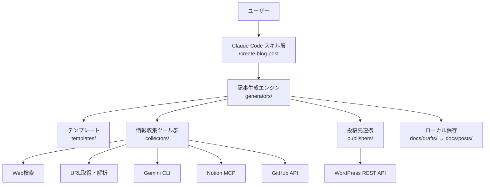
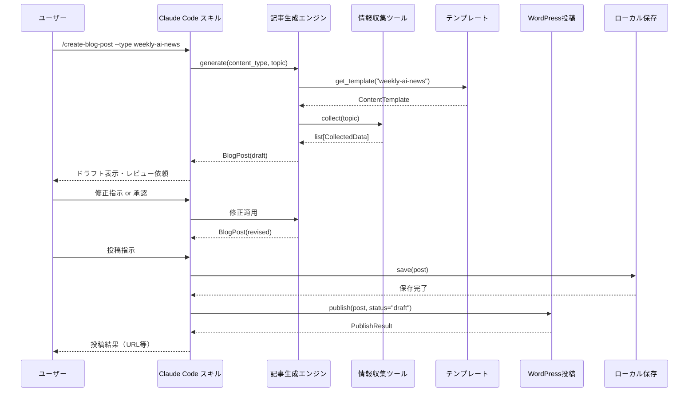

> **ステータス: 計画段階**
> このドキュメントは `docs/ideas/20260213-social-content-creator.md` から生成されました。
> 実装後は `/update-docs` で実態に同期してください。

# 機能設計書 (Functional Design Document)

## システム構成図



## 技術スタック

| 分類 | 技術 | 選定理由 |
|------|------|----------|
| 言語 | Python 3.12+ | AI/MLエコシステムとの親和性 |
| パッケージ管理 | uv | 高速な依存関係解決 |
| HTTP通信 | httpx | async対応、モダンなHTTPクライアント |
| スキル層 | Claude Code Skills | 対話的な操作、柔軟な拡張性 |
| テスト | pytest | Python標準テストフレームワーク |
| Lint/Format | Ruff / Black | 高速なLint・フォーマット |
| 型チェック | mypy | 静的型チェック |

## データモデル定義

### エンティティ: BlogPost

```python
from dataclasses import dataclass, field
from datetime import datetime
from typing import Literal

type ContentType = Literal[
    "weekly-ai-news",
    "paper-review",
    "project-intro",
    "tool-tips",
    "market-analysis",
    "ml-practice",
    "cv",
    "feature",
]

type PostStatus = Literal["draft", "review", "ready", "published"]

@dataclass
class BlogPost:
    """ブログ記事のデータモデル"""
    title: str                              # 記事タイトル
    content: str                            # 記事本文（Markdown）
    content_type: ContentType               # コンテンツタイプ
    status: PostStatus = "draft"            # 記事ステータス
    topic: str | None = None                # トピック・キーワード
    source_url: str | None = None           # 参照URL
    source_repo: str | None = None          # 参照GitHubリポジトリ
    categories: list[str] = field(default_factory=list)  # カテゴリ
    tags: list[str] = field(default_factory=list)        # タグ
    word_count: int = 0                     # 文字数
    created_at: datetime = field(default_factory=datetime.now)  # 作成日時
    updated_at: datetime = field(default_factory=datetime.now)  # 更新日時
    published_url: str | None = None        # 投稿後のURL
```

**制約**:
- `title` は空文字列不可
- `content` は空文字列不可
- `word_count` はcontentから自動算出

### エンティティ: ContentTemplate

```python
@dataclass
class ContentTemplate:
    """コンテンツタイプ別テンプレート"""
    content_type: ContentType               # コンテンツタイプ
    name: str                               # テンプレート名
    description: str                        # テンプレートの説明
    min_words: int                          # 最小文字数
    max_words: int                          # 最大文字数
    sections: list[str]                     # セクション構成
    style_guide: str                        # 文体ガイド
    template_prompt: str                    # 記事生成プロンプト
```

### エンティティ: CollectedData

```python
@dataclass
class CollectedData:
    """情報収集結果"""
    source: str                             # 情報源（web_search, url, gemini, notion, github）
    title: str                              # タイトル
    content: str                            # 内容
    url: str | None = None                  # URL
    collected_at: datetime = field(default_factory=datetime.now)
```

### エンティティ: PublishResult

```python
@dataclass
class PublishResult:
    """投稿結果"""
    success: bool                           # 成功/失敗
    post_id: int | None = None              # WordPress投稿ID
    url: str | None = None                  # 投稿URL
    error_message: str | None = None        # エラーメッセージ
```

## コンポーネント設計

### BlogPostGenerator（記事生成エンジン）

**責務**:
- コンテンツタイプに応じたテンプレートの選択
- 情報収集結果の統合
- 記事ドラフトの生成
- 文体ガイドの適用

**インターフェース**:
```python
from typing import Protocol

class BlogPostGeneratorProtocol(Protocol):
    """記事生成エンジンのインターフェース"""

    async def generate(
        self,
        content_type: ContentType,
        topic: str | None = None,
        source_url: str | None = None,
        source_repo: str | None = None,
    ) -> BlogPost:
        """記事ドラフトを生成する"""
        ...

    def get_template(self, content_type: ContentType) -> ContentTemplate:
        """指定タイプのテンプレートを取得する"""
        ...
```

**依存関係**:
- ContentTemplate（テンプレート）
- Collector群（情報収集）

### WordPressPublisher（WordPress投稿）

**責務**:
- WordPress REST APIとの通信
- 認証処理（Application Passwords）
- 記事の投稿（下書き/公開）
- カテゴリ・タグの設定

**インターフェース**:
```python
class WordPressPublisherProtocol(Protocol):
    """WordPress投稿のインターフェース"""

    async def publish(
        self,
        post: BlogPost,
        status: Literal["draft", "publish"] = "draft",
        categories: list[str] | None = None,
        tags: list[str] | None = None,
    ) -> PublishResult:
        """記事をWordPressに投稿する"""
        ...

    async def get_categories(self) -> list[dict]:
        """カテゴリ一覧を取得する"""
        ...

    async def get_tags(self) -> list[dict]:
        """タグ一覧を取得する"""
        ...
```

**依存関係**:
- httpx（HTTP通信）
- 環境変数（認証情報）

### Collector群（情報収集ツール）

**責務**:
- 各情報源からのデータ取得
- 取得データの正規化

**インターフェース**:
```python
class CollectorProtocol(Protocol):
    """情報収集ツールの共通インターフェース"""

    async def collect(self, query: str, **kwargs) -> list[CollectedData]:
        """情報を収集する"""
        ...
```

**具象クラス**:
- `WebSearchCollector`: Web検索による情報収集
- `URLFetcherCollector`: 指定URLの内容取得・要約
- `GeminiCollector`: Gemini CLI経由の調査レポート生成
- `NotionNewsCollector`: Notion MCP経由でGoogle Alertニュース記事を取得（過去1週間）
- `NotionPaperCollector`: Notion MCP経由でArxiv論文データを取得（テーマ指定/過去1週間）
- `GitHubCollector`: GitHub API経由のリポジトリ情報取得

**依存関係**:
- httpx（HTTP通信）
- Notion MCP（NotionNewsCollector, NotionPaperCollector）
- 各外部API

## ユースケース図

### ユースケース1: ブログ記事の生成と投稿



**フロー説明**:
1. ユーザーがClaude Codeスキルで記事生成を指示
2. 記事生成エンジンがテンプレートを取得し、情報収集を実行
3. 収集データとテンプレートを基に記事ドラフトを生成
4. ユーザーがドラフトをレビューし、対話的に修正
5. 承認後、ローカルに保存してからWordPressに投稿
6. 投稿結果をユーザーに報告

### ユースケース2: 情報収集のみ


## ファイル構造

### 記事保存形式

記事はステータスに応じて `docs/drafts/`（下書き）と `docs/posts/`（投稿済み）に分離して管理する。

#### ドラフト（下書き）

```
docs/drafts/
├── weekly-ai-news/
│   └── 20260213-weekly-ai-news-feb-w2.md
├── paper-review/
│   └── 20260210-arxiv-xxxx.md
└── tool-tips/
    └── 20260211-dify-tips.md
```

- `YYYYMMDD` は**作成日**（ドラフトを生成した日）
- コンテンツタイプ（ジャンル）別にディレクトリを分割

#### 投稿済み

```
docs/posts/
├── 2026/
│   └── 02/
│       ├── 20260213-weekly-ai-news-feb-w2.md
│       └── 20260215-paper-review-xxxx.md
```

- `YYYYMMDD` は**投稿日**（WordPressに投稿した日）であり、ドラフト作成日とは異なる場合がある

#### ドラフトのfront matter例

```markdown
---
title: "2026年2月第2週 AIニュースハイライト"
content_type: weekly-ai-news
status: draft
categories: [AI, ニュース]
tags: [AI, 週刊まとめ, 2026年2月]
created_at: 2026-02-13T18:00:00
---

# 2026年2月第2週 AIニュースハイライト

...記事本文...
```

#### 投稿済みのfront matter例

```markdown
---
title: "2026年2月第2週 AIニュースハイライト"
content_type: weekly-ai-news
status: published
published_url: https://example.com/blog/2026/02/weekly-ai-news
categories: [AI, ニュース]
tags: [AI, 週刊まとめ, 2026年2月]
created_at: 2026-02-13T18:00:00
published_at: 2026-02-15T19:00:00
---

# 2026年2月第2週 AIニュースハイライト

...記事本文...
```

### テンプレート保存形式

```
src/templates/
├── weekly_ai_news.py
├── paper_review.py
├── project_intro.py
├── tool_tips.py
├── market_analysis.py
├── ml_practice.py
├── cv.py
└── feature.py
```

## パフォーマンス最適化

- **非同期処理**: 情報収集ツールはasyncで並行実行し、記事生成の待ち時間を短縮
- **キャッシュ**: 頻繁にアクセスするカテゴリ・タグ一覧はキャッシュして再利用
- **ストリーミング**: 長文記事の生成時はストリーミング出力で体感速度を向上

## セキュリティ考慮事項

- **認証情報管理**: WordPress API認証情報は `.env` ファイルで管理し、`.gitignore` で除外
- **入力検証**: ユーザー入力（トピック、URL等）のバリデーション実施
- **API通信**: HTTPS必須、タイムアウト設定
- **ローカル保存**: 生成記事はローカルファイルとして保存し、投稿失敗時のデータ損失を防止

## エラーハンドリング

### エラーの分類

| エラー種別 | 処理 | ユーザーへの表示 |
|-----------|------|-----------------|
| WordPress API認証エラー | リトライ不可、設定確認を案内 | 「WordPress認証に失敗しました。.envの設定を確認してください」 |
| WordPress API通信エラー | 3回リトライ後に失敗 | 「WordPress接続に失敗しました。ローカルにドラフトを保存しました」 |
| 情報収集タイムアウト | スキップして利用可能なデータで生成 | 「一部の情報収集がタイムアウトしました。取得済みデータで記事を生成します」 |
| URL取得エラー | スキップ | 「指定URLの取得に失敗しました: {url}」 |
| テンプレート不存在 | デフォルトテンプレートを使用 | 「指定タイプのテンプレートが見つかりません。汎用テンプレートを使用します」 |
| 入力バリデーションエラー | 即時エラー | 「{field}が不正です: {reason}」 |

## テスト戦略

### ユニットテスト
- BlogPostGenerator: テンプレート適用、ドラフト生成ロジック
- WordPressPublisher: API呼び出し（モック）、レスポンスパース
- Collector群: 各情報源からのデータ取得（モック）
  - NotionNewsCollector: Google Alertニュース取得（過去1週間フィルタ）
  - NotionPaperCollector: Arxiv論文取得（テーマ指定/期間指定）
- ContentTemplate: テンプレートのロード・バリデーション

### 統合テスト
- 記事生成→ローカル保存の一連フロー
- 情報収集→記事生成の連携
- Notion DB取得→週刊AIニュース記事生成の連携
- Notion DB取得→論文レビュー記事生成の連携
- テンプレート選択→記事構成の整合性

### E2Eテスト
- `/create-blog-post` コマンドの実行→記事生成→投稿の全フロー（WordPress APIはモック）
