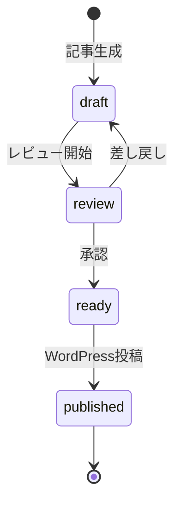

> **ステータス: 実装済み**
> 最終更新: 2026-02-17

# プロジェクト用語集 (Glossary)

## 概要

このドキュメントは、Social Content Creator プロジェクト内で使用される用語の定義を管理します。

**更新日**: 2026-02-17

## ドメイン用語

プロジェクト固有のビジネス概念や機能に関する用語。

### コンテンツタイプ (Content Type)

**定義**: ブログ記事の種類を分類するカテゴリ

**説明**: 各コンテンツタイプにはそれぞれ専用のテンプレート（構成、文字数目安、セクション構成）が定義されている。記事生成時に `--type` オプションで指定する。

**関連用語**: テンプレート、記事生成スキル

**使用例**:
- `weekly-ai-news`: 週刊AIニュースハイライト
- `paper-review`: 論文解説
- `project-intro`: GitHubプロジェクト紹介
- `tool-tips`: ツール・Tips紹介
- `market-analysis`: AI×株式投資・企業分析
- `ml-practice`: AI×データ分析・ML開発
- `cv`: 画像認識・コンピュータビジョン
- `feature`: 特集記事

**英語表記**: Content Type

### テンプレート (Template)

**定義**: コンテンツタイプごとに定義された記事の雛形

**説明**: 記事の構成（見出し構成、セクション）、文字数目安、文体ガイドを定義する。テンプレートはPythonモジュールとして `src/templates/` に配置される。

**関連用語**: コンテンツタイプ、記事生成エンジン

**使用例**:
- 「週刊AIニュースのテンプレートには、ニュース一覧セクションとまとめセクションが含まれる」
- 「テンプレートの文字数目安は3,000〜5,000字」

**英語表記**: Template

### ドラフト (Draft)

**定義**: 記事生成エンジンが出力した、レビュー・編集前の記事

**説明**: ユーザーが対話的にレビュー・修正を行い、承認後にWordPressに投稿される。ローカルファイルとして `docs/drafts/` に保存される。

**関連用語**: BlogPost、投稿ステータス

**英語表記**: Draft

### Aidotters

**定義**: プロジェクトオーナーのAIエンジニアとしてのブランド名

**説明**: ブログ記事やSNS投稿の著者名として使用される。情報発信のブランドアイデンティティ。

**関連用語**: スタイルガイド

**英語表記**: Aidotters

### Google Alertニュース DB

**定義**: Notionに構築された、Google Alertで収集したAI関連ニュース記事の保存データベース

**説明**: Google Alertが配信するニュース記事をNotionに蓄積したもの。`NotionNewsCollector` が過去1週間の記事を取得し、週刊AIニュース等の記事生成ソースとして活用する。

**関連用語**: Notion MCP、NotionNewsCollector、コンテンツタイプ（weekly-ai-news）

**英語表記**: Google Alert News Database

### Arxiv論文 DB

**定義**: Notionに構築された、Arxivから収集したAI関連論文の保存データベース

**説明**: Arxivの論文情報（タイトル、著者、要約、カテゴリ等）をNotionに蓄積したもの。`NotionPaperCollector` が過去1週間の論文リストやテーマ指定での検索結果を取得し、論文レビュー記事の生成ソースとして活用する。

**関連用語**: Notion MCP、NotionPaperCollector、コンテンツタイプ（paper-review）

**英語表記**: Arxiv Paper Database

### スタイルガイド (Style Guide)

**定義**: 記事の文体・トーンを定義するルール

**説明**: です・ます調、丁寧かつ親しみやすい文体を基本とする。カジュアルすぎず、フォーマルすぎない中間。専門用語は初出時に簡潔に説明する。

**関連用語**: テンプレート、コンテンツタイプ

**英語表記**: Style Guide

## 技術用語

プロジェクトで使用している技術・フレームワーク・ツールに関する用語。

### Claude Code

**定義**: AnthropicのCLI型AI開発アシスタント

**公式サイト**: https://claude.ai/code

**本プロジェクトでの用途**: スキル層として、ユーザーとの対話インターフェースを提供。`/create-blog-post` スキルの実行環境。

**バージョン**: 最新

**関連ドキュメント**: `architecture.md` - スキル層の設計

### Claude Code Skills

**定義**: Claude Codeのカスタムスキル機能

**公式サイト**: https://claude.ai/code

**本プロジェクトでの用途**: `/create-blog-post` コマンドをスキルとして定義し、記事生成の対話フローを実装する。`.claude/skills/` ディレクトリに配置。

**関連ドキュメント**: `repository-structure.md` - `.claude/` ディレクトリ構造

### WordPress REST API

**定義**: WordPressのHTTPベースのREST API

**公式サイト**: https://developer.wordpress.org/rest-api/

**本プロジェクトでの用途**: ブログ記事の投稿（下書き/公開）、カテゴリ・タグの管理に使用。`src/publishers/wordpress.py` で実装。

**バージョン**: WordPress 6.x

**関連ドキュメント**: `functional-design.md` - WordPress投稿コンポーネント

### Application Passwords

**定義**: WordPress 5.6以降で標準搭載されたAPI認証機能

**本プロジェクトでの用途**: WordPress REST APIの認証に使用。環境変数 `WORDPRESS_APP_PASSWORD` で管理。

**関連ドキュメント**: `architecture.md` - セキュリティアーキテクチャ

### X API v2

**定義**: X（旧Twitter）のHTTPベースのREST API（バージョン2）

**公式サイト**: https://developer.x.com/

**本プロジェクトでの用途**: ツイート投稿（1ツイート / スレッド）に使用。`src/publishers/x.py` で実装。OAuth 1.0a User Contextで認証。

**関連ドキュメント**: `functional-design.md` - XPublisherコンポーネント

### authlib

**定義**: Python用のOAuth認証ライブラリ

**公式サイト**: https://authlib.org/

**本プロジェクトでの用途**: X API v2のOAuth 1.0a認証に使用。`src/publishers/x.py` で利用。

**バージョン**: 1.3+

### httpx

**定義**: Python用の非同期対応HTTPクライアントライブラリ

**公式サイト**: https://www.python-httpx.org/

**本プロジェクトでの用途**: WordPress API通信、URL取得、Web検索API通信に使用。

**バージョン**: 0.27+

### Gemini CLI

**定義**: Google の Gemini AI モデルをコマンドラインから利用するツール

**本プロジェクトでの用途**: 記事作成のための調査レポート生成。`src/collectors/gemini.py` で連携。

### Notion MCP

**定義**: Notion APIをModel Context Protocol (MCP)経由で利用する仕組み

**本プロジェクトでの用途**: Phase 1のコア機能として、Google AlertニュースDB（`NotionNewsCollector`）およびArxiv論文DB（`NotionPaperCollector`）からのデータ取得に使用。記事生成のソースとして活用する。

**関連ドキュメント**: `product-requirements.md` - 機能4・5: Notion DB連携

### pytest

**定義**: Python用のテストフレームワーク

**公式サイト**: https://docs.pytest.org/

**本プロジェクトでの用途**: ユニットテスト、統合テストの実行

**バージョン**: 8.0+

### Ruff

**定義**: Rust製の高速Python Linter・Formatter

**公式サイト**: https://docs.astral.sh/ruff/

**本プロジェクトでの用途**: コードのLintチェック

**バージョン**: 0.8+

## 略語・頭字語

### PRD

**正式名称**: Product Requirements Document

**意味**: プロダクト要求定義書。プロダクトの目的、ターゲットユーザー、機能要件、非機能要件を定義する文書。

**本プロジェクトでの使用**: `docs/core/product-requirements.md`

### API

**正式名称**: Application Programming Interface

**意味**: ソフトウェア間のインターフェース仕様

**本プロジェクトでの使用**: WordPress REST API、GitHub API、Notion API等の外部サービス連携

### MCP

**正式名称**: Model Context Protocol

**意味**: AIモデルが外部サービスと連携するためのプロトコル

**本プロジェクトでの使用**: Notion MCP経由でのデータ取得

### MVP

**正式名称**: Minimum Viable Product

**意味**: 実用最小限の製品。最小限の機能で価値を提供できる状態。

**本プロジェクトでの使用**: Phase 1（ブログ記事生成・WordPress投稿）がMVPに相当

### PV

**正式名称**: Page View

**意味**: ページの閲覧回数

**本プロジェクトでの使用**: 成功指標（KPI）として月間PVを設定

## アーキテクチャ用語

### スキル層 (Skill Layer)

**定義**: Claude Code Skills で実装されるユーザーインターフェース層

**本プロジェクトでの適用**: `/create-blog-post` コマンドの処理、対話的な記事レビュー・修正のフロー制御、`/publish-to-x` コマンドのX投稿フロー制御を担当

**関連コンポーネント**: `.claude/skills/create-blog-post/`, `.claude/skills/publish-to-x/`

**図解**:
```
ユーザー → スキル層（Claude Code）→ ツール層（Python）
```

### ツール層 (Tool Layer)

**定義**: Python で実装されるバックエンドロジック層

**本プロジェクトでの適用**: 記事生成エンジン、情報収集ツール群、WordPress投稿機能を含む。`src/` ディレクトリに配置。

**関連コンポーネント**: `src/generators/`, `src/collectors/`, `src/publishers/`

### Collector パターン

**定義**: 複数の情報源からデータを収集する際の共通インターフェースパターン

**本プロジェクトでの適用**: `CollectorProtocol` を定義し、WebSearch, URLFetcher, Gemini, NotionNews, NotionPaper, GitHub 等の各Collectorが同一インターフェースでデータを返す。新しい情報源の追加が容易。

**関連コンポーネント**: `src/collectors/base.py`

### Publisher パターン

**定義**: 複数の投稿先プラットフォームに対して共通インターフェースで投稿するパターン

**本プロジェクトでの適用**: `PublisherProtocol` を定義し、WordPressPublisher（WordPress投稿）、XPublisher（X投稿）の各Publisherが同一インターフェースで投稿する。

**関連コンポーネント**: `src/publishers/base.py`

## ステータス・状態

### 記事ステータス (Post Status)

| ステータス | 意味 | 遷移条件 | 次の状態 |
|----------|------|---------|---------|
| `draft` | ドラフト（生成直後） | 記事生成完了 | `review` |
| `review` | レビュー中 | ユーザーがレビュー開始 | `ready` / `draft`（差し戻し） |
| `ready` | 投稿準備完了 | ユーザーが承認 | `published` |
| `published` | 投稿済み | WordPress投稿完了 | - |

**状態遷移図**:


## データモデル用語

### BlogPost

**定義**: ブログ記事を表すデータモデル

**主要フィールド**:
- `title`: 記事タイトル
- `content`: 記事本文（Markdown）
- `content_type`: コンテンツタイプ
- `status`: 記事ステータス
- `slug`: URLスラッグ
- `categories`: カテゴリ一覧
- `tags`: タグ一覧
- `wordpress_id`: WordPress投稿ID
- `wordpress_url`: WordPress投稿URL

**関連エンティティ**: ContentTemplate, PublishResult

### ContentTemplate

**定義**: コンテンツタイプ別のテンプレートデータモデル

**主要フィールド**:
- `content_type`: コンテンツタイプ
- `min_words` / `max_words`: 文字数目安
- `sections`: セクション構成（`list[TemplateSection]`）
- `style_guide`: 文体ガイド

**関連エンティティ**: BlogPost

### CollectedData

**定義**: 情報収集結果を表すデータモデル

**主要フィールド**:
- `source`: 情報源（web_search, url, gemini, github, notion_news, notion_paper）
- `title`: タイトル
- `content`: 内容
- `url`: URL

**関連エンティティ**: BlogPost

### PublishResult

**定義**: 投稿結果を表すデータモデル

**主要フィールド**:
- `success`: 成功/失敗
- `post_id`: WordPress投稿ID
- `url`: 投稿URL
- `error_message`: エラーメッセージ

**関連エンティティ**: BlogPost

### XPublishResult

**定義**: X投稿結果を表すデータモデル

**主要フィールド**:
- `success`: 成功/失敗
- `tweet_id`: ツイートID
- `tweet_url`: ツイートURL
- `thread_ids`: スレッド投稿時の全ツイートIDリスト
- `error_message`: エラーメッセージ

**関連エンティティ**: BlogPost

## エラー・例外

### ContentCreatorError

**クラス名**: `ContentCreatorError`

**発生条件**: プロジェクト内の全カスタムエラーの基底クラス。直接発生させるケースは少なく、サブクラス（`WordPressPublishError`, `CollectionError`, `XPublishError`, `TemplateNotFoundError`, `DraftSaveError`）を通じて使用される。

**対処方法**: サブクラスごとの対処方法を参照。

### DraftSaveError

**クラス名**: `DraftSaveError`

**発生条件**: ドラフト記事のファイル保存に失敗した場合（ディスク容量不足、パーミッションエラー、移動先ファイルの重複等）

**対処方法**: 保存先パスの権限・空き容量を確認。移動先重複の場合はファイル名を変更。

### WordPressPublishError

**クラス名**: `WordPressPublishError`

**発生条件**: WordPress REST API への投稿が失敗した場合（認証エラー、通信エラー等）

**対処方法**: `.env` のWordPress設定を確認。通信エラーの場合はリトライ。

### CollectionError

**クラス名**: `CollectionError`

**発生条件**: 情報収集ツールがデータ取得に失敗した場合（タイムアウト、API制限等）

**対処方法**: 該当の情報源をスキップし、取得済みデータで記事を生成。

### XPublishError

**クラス名**: `XPublishError`

**発生条件**: X API v2 への投稿が失敗した場合（認証エラー、レート制限、通信エラー等）

**対処方法**: `.env` の `X_API_KEY`, `X_API_SECRET`, `X_ACCESS_TOKEN`, `X_ACCESS_TOKEN_SECRET` を確認。ネットワークエラーの場合は自動で1回リトライされる。

### TemplateNotFoundError

**クラス名**: `TemplateNotFoundError`

**発生条件**: 指定されたコンテンツタイプに対応するテンプレートが存在しない場合

**対処方法**: 有効なコンテンツタイプを指定するか、デフォルトテンプレートを使用。
